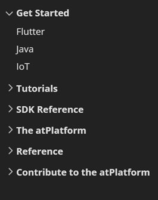

<h1> Project 2 : Java Byte AtServer Operations</h1>

**Introduction:**

  -	In this project we were expected to Implement _getBinary(AtKey) and _put(AtKey, byte[]) method for Public , Self and Shared key in AtClientImpl.java Class.
  -	This class will be located at at_java/at_client/src/main/java/org/atsign/client/api/impl/clients/AtClientImpl.java in the github repository.
  
  
**Objective:**

  -	The AtServer operations are currently carried out using String. Our primary goal is to introduce functionality that will allow Java atserver actions to use bytes [] rather     than strings.
  -	 Please read the Power Point Presentation to learn about our journey and how to manage this project.

  
  
**Setup:**

1.	 In order to proceed with this step, please visit the Get Started page on the atSign website (the link is provided below).

     https://docs.atsign.com/start/

     - When you click the link on the left, you will see options like these
     
       
       
       Click Java, then proceed as directed.

2.	 After completing the Setting Up Your Development Environment phase, follow the instructions for the Registration CLI on the same page. 

     - Important: Don’t use this one which is given in the website.

      

    - To be Considered: A new atSign will be onboarded for the step to run the Register.java CLI, and a set of.atKeys will be produced. 
    - To get the atSign For free, run the following code in command Prompt:

       " java -cp "target/at_client-1.0-SNAPSHOT.jar;target/lib/*" org.atsign.client.cli.Register -e yourEmail@gmail.com  "              

      After all this You are all set. Your key will be in this " C:\Users\User_name \.atsign\keys " location on your System.

**Build and Run:**

Build and Run this project on your local system, please follow these steps:
  1.  Clone the repository to your local machine.
  2.  Ensure that you have successfully completed the setup steps mentioned earlier.
  3.  Confirm that you have obtained your atsign.
  4.  Open the cloned repository in your preferred IDE, such as VS Code.
  5.  Locate and open the TemporaryTestForByteAtClientOperation.java test file, which can be found at the following path:                             at_java/at_client/src/test/java/org/atsign/common/TemporaryTestForByteAtClientOperation.java.
  6.  In the test class, add your atsign at the designated location.
         
      
  7.  Now you are ready to run the TemporaryTestForByteAtClientOperation test class.
  8.  Upon running the test class, you will see the output, which will indicate that the getBinary and put methods for byte[] have been tested for all three keys: Public, Self, and Shared.
